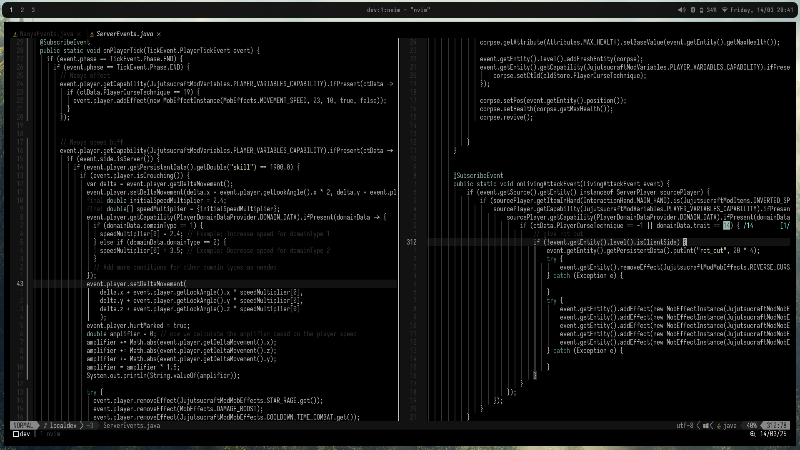
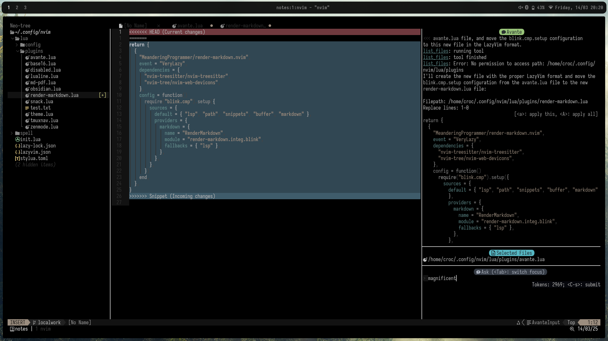
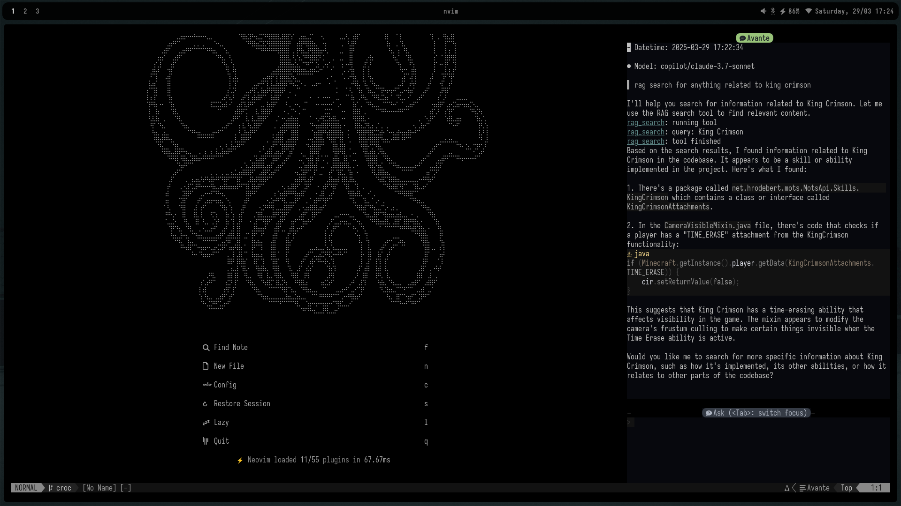
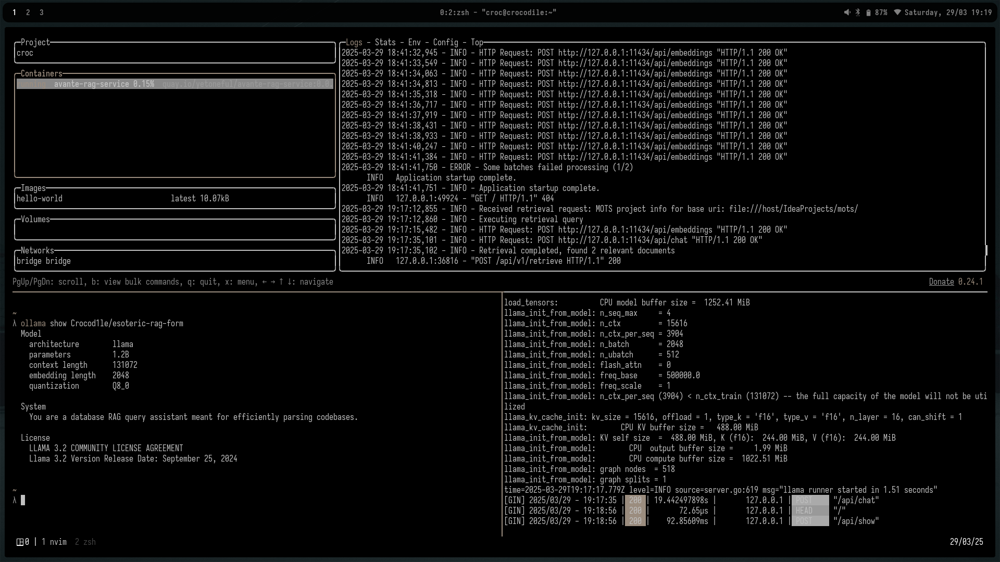

# Neovim Configuration

 

Personal Neovim configuration based on lazy.nvim.
This is meant to function as a note taker or a development environment, mainly for java.
A pretty maximalist but very optimised setup that does everything I _personally_ could need it to do.

## Features

- Built on lazy.nvim for better plugin management
- Code completion and LSP support
- File navigation and fzf with ripgrep
- Git functionality
  - Lualine git information display
  - Lazygit integration
- Markdown/Obsidian support
- Discord presence

---

## Model Integration

 

- Avante.nvim code editing workflow
- Copilot support with model switching capabilities
- Support for multiple AI providers (OpenRouter, Ollama)
- Retrieval Augmented Generation Support
  - Running Ollama endpoint
  - Crocod1le/esoteric-rag-form as LLM
  - Cracked version of Multilingual e5 as embed modes l
- Modular self generated MCP server integration
  - File/directory operation (view, grep, rename, delete, etc.)
  - Search codebase, dispatch search agents
  - Execute code (bash, python)
  - Web search/scrape, fetch, and puppet agents
  - Memory graphs
  - Sequential thinking and behaviour mods
  - Git and Github operations
  - Context management and definition retrieval

## Structure

Main configuration files:

- `init.lua`: lazy.nvim initialisation
- `lua/config/`: Core configuration files, autocmds
- `lua/plugins/`: Plugin-specific configurations and installation
